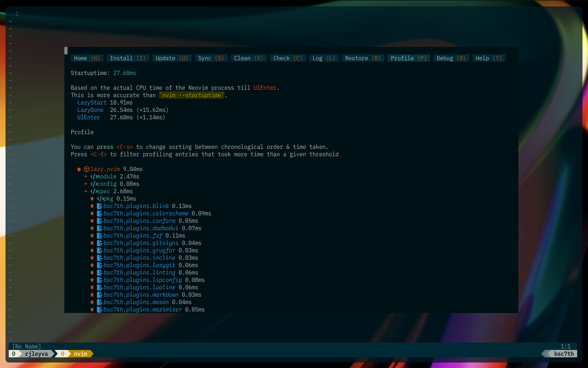
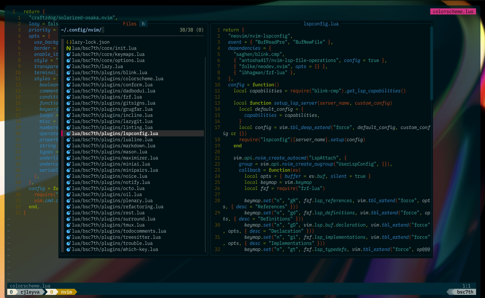
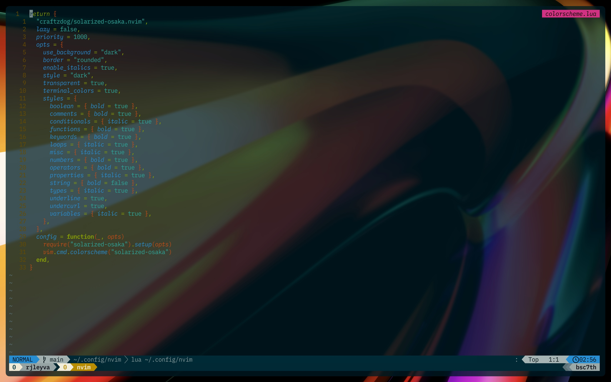
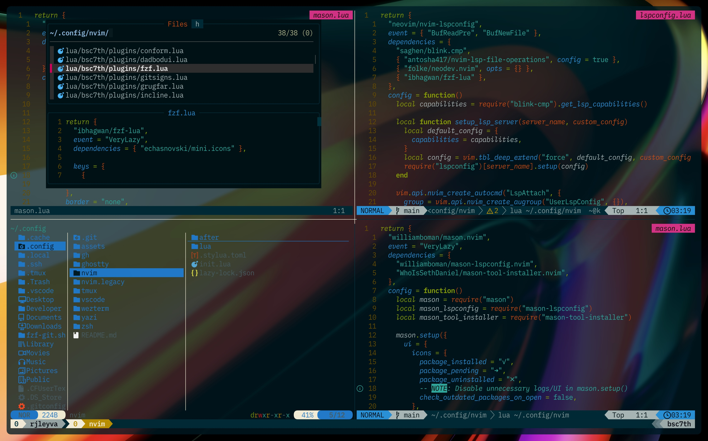
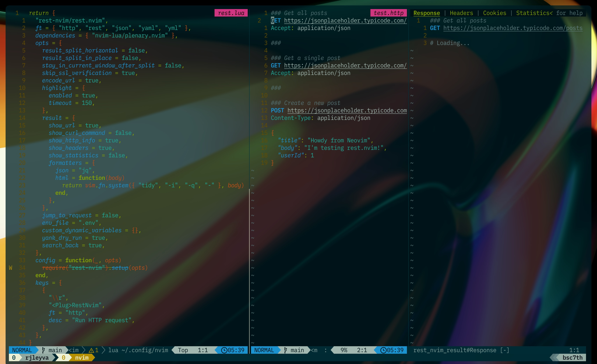
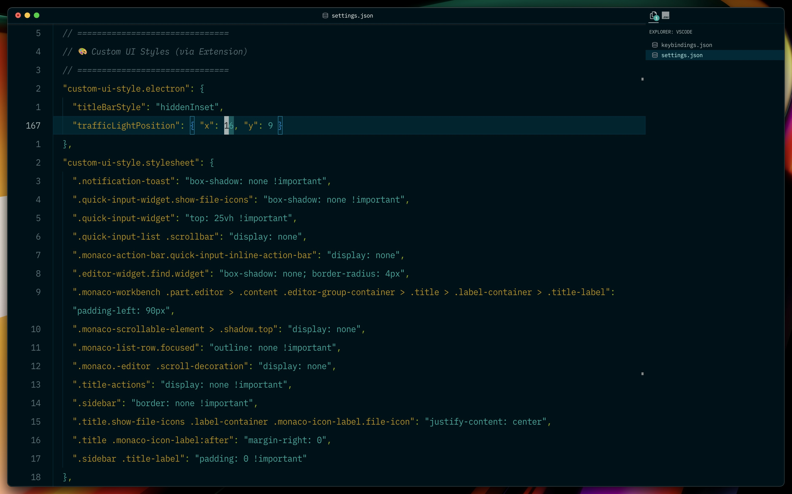

# bsc7th Dotfiles

Welcome to my personal dotfiles, the configuration I use daily as I continue my journey in web development. This setup evolves as I learn and discover better tools and workflows.

## Inspiration

I'm deeply grateful to the developers who have inspired and guided my setup:

### [Folke](https://github.com/folke)

Many of the plugins I use are inspired by Folke’s incredible work. I started by exploring his [LazyVim](https://www.lazyvim.org/) distro, then gradually customized and adapted it using the [lazy.nvim](https://lazy.folke.io/) plugin manager. His work helped me build a strong foundation for my Neovim setup.

### [Takuya Matsuyama (craftzdog / devaslife)](https://github.com/craftzdog)

Takuya’s aesthetic and workflow had a big influence on me. I use his [solarized-osaka](https://github.com/craftzdog/solarized-osaka.nvim) colorscheme with italics enabled to help me visually distinguish syntax more easily, which is especially helpful as a beginner.  
His approach to coding and note-taking has inspired me to use [Neovim](https://neovim.io/) as my primary writing and note-taking tool, with everything stored on [GitHub](https://github.com/). I'm also looking forward to subscribing to [Inkdrop](https://www.inkdrop.app/), not just to support Takuya’s work, but because I genuinely believe in the product.

### [Josean Martinez](https://github.com/josean-dev)

Josean’s Neovim tutorials on [YouTube](https://www.youtube.com/watch?v=6pAG3BHurdM) played a huge role in shaping my configuration and understanding of [ lazy.nvim ](https://lazy.folke.io/). His videos were the spark that got me into Neovim and self-taught web development in the first place.
Most of my keymaps and structural choices are based on his setup, though I've made a few changes to accommodate new plugins and avoid conflicts.  
If you're new to Neovim, I highly recommend watching his [videos](https://www.youtube.com/watch?v=6pAG3BHurdM), they’re clear, beginner-friendly, and incredibly valuable.

### [Mateo Sindičić (JazzyGrim / Sindo)](https://github.com/JazzyGrim/dotfiles/)

I discovered plugins like [`rest.nvim`](https://github.com/rest-nvim/rest.nvim) and [`neotest`](https://github.com/nvim-neotest/neotest) thanks to his [YouTube video](https://www.youtube.com/watch?v=V070Zmvx9AM).  
His content introduced me to the idea of integrating testing into my daily workflow, even for small projects like my blog. I also learned how to send HTTP requests directly from Neovim using `rest.nvim`, which has become a surprisingly useful part of my toolkit.

## Purpose

This configuration is tailored for my current tech stack and goals:

- Primarily focused on frontend development using **React** and **Astro**
- Some backend work using **Go (Golang)**

As I grow and learn, I continue refining and improving this setup to better support my workflow.

> ⚠️ **Note:** This setup is highly personal and tailored to my specific needs. I don’t recommend copying it directly. Instead, feel free to explore, take inspiration, and adapt it to fit your own preferences and tools.

## Exploring VSCode

### [Igor Babko](https://github.com/IgorBabko/)

Recently, I began exploring other editors like **[VSCode](https://code.visualstudio.com/)** to see what useful features I could bring into my Neovim setup. I was curious to find out how customizable VSCode really is, and to my surprise, it's quite flexible.
I’ve been learning how to tweak it much like Neovim, setting up my own key mappings (since I mostly navigate with the keyboard and rarely use the trackpad), customizing the interface, and making it feel like home.
My current VSCode configuration is based on a fantastic [YouTube video by Igor Babko](https://www.youtube.com/watch?v=VmFOsK7IhI4). If you're a VSCode user and want to tailor it to feel more like Neovim, I highly recommend checking out his guide.

### Thank you for stopping by, and happy coding!
