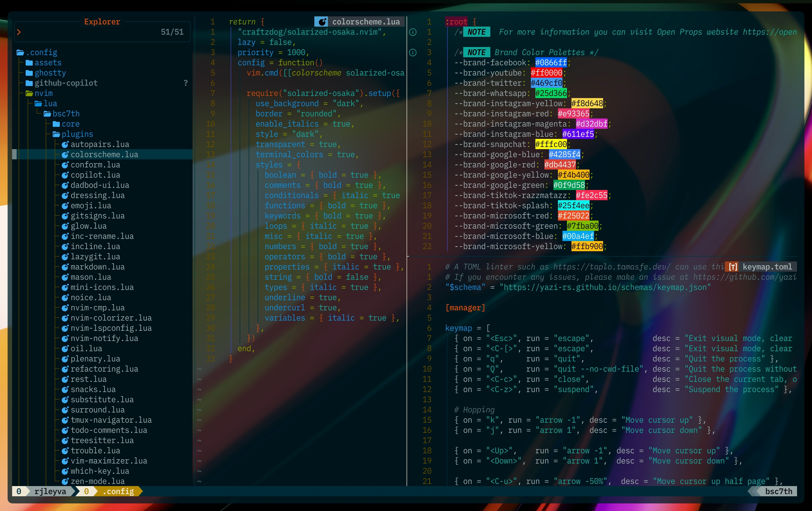
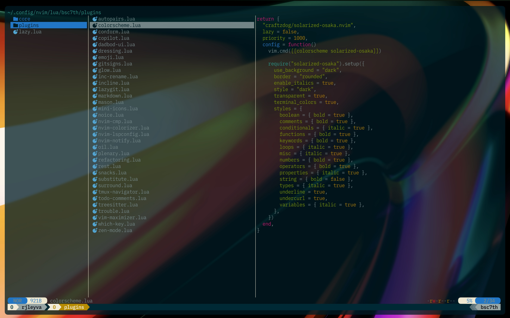

# bsc7th's dotfiles

Most of my plugins come from [Folke's](https://github.com/folke) Neovim config, with a few others from talented developers at Neovim Spectrum. My workflow is inspired by [Josean Martinez's](https://github.com/josean-dev) and [Takuya Matsuyama](https://github.com/craftzdog), also known as [craftzdog](https://github.com/craftzdog) or [devaslife](https://www.youtube.com/results?search_query=devaslife) on YouTube. You can also use the Neovim website as a guide, as it provides detailed information on each repository, helping you better understand how things work.

If you need detailed, beginner-friendly guidelines on how to set up Neovim from scratch, I highly recommend the following:

- [How I Setup Neovim To Make It AMAZING in 2024: The Ultimate Guide](https://www.youtube.com/watch?v=6pAG3BHurdM) by [Josean Martinez](https://github.com/josean-dev)

- [0 to LSP : Neovim RC From Scratch](https://www.youtube.com/watch?v=w7i4amO_zaE) by [ThePrimeagen](https://github.com/ThePrimeagen)

- [The Only Video You Need to Get Started with Neovim](https://www.youtube.com/watch?v=m8C0Cq9Uv9o) by [TJ DeVries](https://github.com/tjdevries)

If you're using [LazyVim distro](https://www.lazyvim.org/) I recommend the following:

- [LazyVim Documentation](https://www.lazyvim.org/)

- [Effective Neovim setup for web development towards 2024](https://www.youtube.com/watch?v=fFHlfbKVi30) by [Takuya Matsuyama](https://github.com/craftzdog) also koown as [devaslife](https://www.youtube.com/@devaslife) on YouTube, and [craftzdog](https://github.com/craftzdog) on GitHub.

- [LazyVim From Scratch To BEAST MODE](https://www.youtube.com/watch?v=evCmP4hH7ZU) by [Omer Hamerman](https://www.youtube.com/@devopstoolbox) also known as [DevOps Toolbox](https://www.youtube.com/@devopstoolbox) on YouTube, and [omerxx](https://github.com/omerxx) on GitHub.

- [Effective NeoVim Setup for Full-Stack Web Development in 2024](https://www.youtube.com/watch?v=V070Zmvx9AM) by [Mateo Sindičić](https://www.youtube.com/@sindo_dev) also known as [Sindo](https://www.youtube.com/@sindo_dev) on YouTube, and [JazzyGrim](https://github.com/JazzyGrim?tab=repositories) on GitHub.

## My Current Plugins

### [nvim-autopairs](https://dotfyle.com/plugins/windwp/nvim-autopairs)

It provides a seamless experience for inserting and handling paired characters in various filetypes.

### [solarized-osaka](https://dotfyle.com/plugins/craftzdog/solarized-osaka.nvim)

A clean, dark Neovim theme written in Lua, with support for lsp, treesitter and lots of plugins.

### [conform.nvim](https://dotfyle.com/plugins/stevearc/conform.nvim)

Lightweight yet powerful formatter plugin for Neovim

### [copilot.lua](https://dotfyle.com/plugins/zbirenbaum/copilot.lua)

Fully featured & enhanced replacement for copilot.vim complete with API for interacting with Github Copilot

### [vim-dadbod-ui](https://github.com/bsc7th/dotfiles/blob/main/nvim/lua/bsc7th/plugins/dadbod-ui.lua)

A remote neovim plugin for viewing Dadbod query results in a web browser

### [dressing.nvim](https://dotfyle.com/plugins/stevearc/dressing.nvim)

Neovim plugin to improve the default vim.ui interfaces

### [emoji.nvim](https://dotfyle.com/plugins/allaman/emoji.nvim)

A plugin to search for and insert emojis/kaomojis, with auto-completion support, right from Neovim

### [gitsigns.nvim](https://dotfyle.com/plugins/lewis6991/gitsigns.nvim)

A Git integration plugin for Neovim that provides signs and hunk actions in the sign column

### [glow.nvim](https://dotfyle.com/plugins/ellisonleao/glow.nvim)

A markdown preview directly in your neovim.

### [inc-rename.nvim](https://dotfyle.com/plugins/smjonas/inc-rename.nvim)

Incremental LSP renaming based on Neovim's command-preview feature.

### [incline.nvim](https://dotfyle.com/plugins/b0o/incline.nvim)

Floating statuslines for Neovim, winbar alternative

### [lazygit.nvim](https://dotfyle.com/plugins/kdheepak/lazygit.nvim)

Plugin for calling lazygit from within neovim.

### [mardown.nvim](https://dotfyle.com/plugins/MeanderingProgrammer/markdown.nvim)

Plugin to improve viewing Markdown files in Neovim

### [mason.nvim](https://dotfyle.com/plugins/williamboman/mason.nvim)

Easily install and manage LSP servers, DAP servers, linters, and formatters.

### [mini.icons](https://dotfyle.com/plugins/echasnovski/mini.icons)

Icon provider. Part of 'mini.nvim' library.

### [noice.nvim](https://dotfyle.com/plugins/folke/noice.nvim)

Highly experimental plugin that completely replaces the UI for messages, cmdline and the popupmenu.

### [nvim-cmp](https://dotfyle.com/plugins/hrsh7th/nvim-cmp)

A completion plugin for neovim coded in Lua.

### [nvim-colorizer.lua](https://dotfyle.com/plugins/catgoose/nvim-colorizer.lua)

The fastest Neovim colorizer

### [nvim-lspconfig](https://dotfyle.com/plugins/neovim/nvim-lspconfig)

Quickstart configs for Nvim LSP

### [nvim-notify](https://dotfyle.com/plugins/rcarriga/nvim-notify)

A fancy, configurable, notification manager for NeoVim

### [oil.nvim](https://dotfyle.com/plugins/stevearc/oil.nvim)

Neovim file explorer: edit your filesystem like a buffer

### [plenary.nvim](https://dotfyle.com/plugins/nvim-lua/plenary.nvim)

Plenary: full; complete; entire; absolute; unqualified. All the lua functions I don't want to write twice.

### [refactoring.nvim](https://github.com/ThePrimeagen/refactoring.nvim) by [ThePrimeagen](https://github.com/ThePrimeagen)

Neovim plugin developed by ThePrimeagen that facilitates code refactoring within the editor.

### [rest.nvim](https://dotfyle.com/plugins/rest-nvim/rest.nvim)

A very fast, powerful, extensible and asynchronous Neovim HTTP client written in Lua.

### [snacks.nvim](https://dotfyle.com/plugins/folke/snacks.nvim)

A collection of QoL plugins for Neovim

### [substitute.nvim](https://dotfyle.com/plugins/gbprod/substitute.nvim)

Neovim plugin introducing a new operators motions to quickly replace and exchange text.

### [nvim-surround](https://dotfyle.com/plugins/kylechui/nvim-surround)

Add/change/delete surrounding delimiter pairs with ease. Written with :heart: in Lua.

### [vim-tmux-navigator](https://github.com/christoomey/vim-tmux-navigator)

Seamless navigation between tmux panes and vim splits

### [todo-comments.nvim](https://dotfyle.com/plugins/folke/todo-comments.nvim)

Highlight, list and search todo comments in your projects

### [nvim-treesitter](https://dotfyle.com/plugins/nvim-treesitter/nvim-treesitter)

Nvim Treesitter configurations and abstraction layer

### [trouble.nvim](https://dotfyle.com/plugins/folke/trouble.nvim)

A pretty diagnostics, references, telescope results, quickfix and location list to help you solve all the trouble your code is causing.

### [vim-maximizer](https://github.com/szw/vim-maximizer)

Maximizes and restores the current window in Vim.

### [which-key.nvim](https://dotfyle.com/plugins/folke/which-key.nvim)

Create key bindings that stick. WhichKey helps you remember your Neovim keymaps, by showing available keybindings in a popup as you type.

### [zen-mode.nvim](https://dotfyle.com/plugins/folke/zen-mode.nvim)

Distraction-free coding for Neovim

## [TMUX Configuration](https://github.com/tmux/tmux/wiki)

I use [Takuya Matsuyama](https://github.com/craftzdog) tmux custom theme and [Josean Martinez's](https://github.com/josean-dev?tab=repositories) keybindings.

[tmux.conf](https://github.com/bsc7th/dotfiles/blob/main/tmux/.tmux.conf)

[craftzdog macos.conf](https://github.com/craftzdog/dotfiles-public/blob/master/.config/tmux/macos.conf)

[craftzdog statusline.conf](https://github.com/craftzdog/dotfiles-public/blob/master/.config/tmux/statusline.conf)

[cratfzdog theme.conf](https://github.com/craftzdog/dotfiles-public/blob/master/.config/tmux/theme.conf)

[craftzdog utility.conf](https://github.com/craftzdog/dotfiles-public/blob/master/.config/tmux/utility.conf)

## [Yazi Configuration](https://yazi-rs.github.io/docs/installation/)

[keymap.toml](https://github.com/bsc7th/dotfiles/blob/main/yazi/keymap.toml)

[yazi.toml](https://github.com/bsc7th/dotfiles/blob/main/yazi/yazi.toml)
