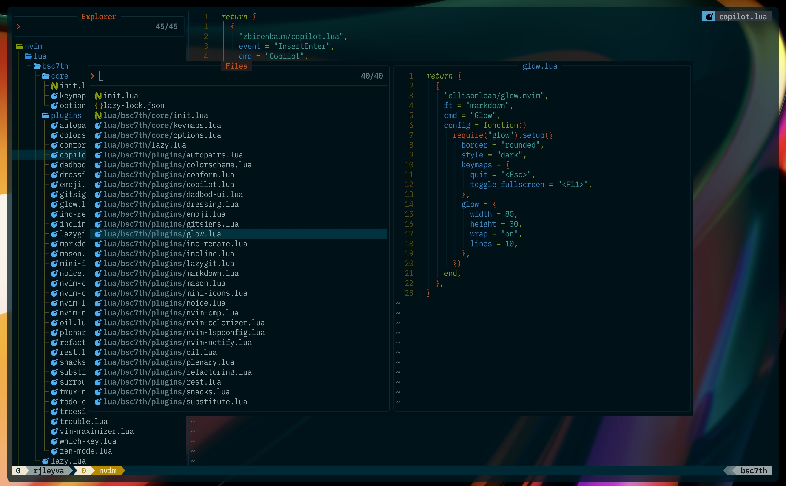

# bsc7th's dotfiles

**Important**: Most of my plugins come from [Folke's](https://github.com/folke) Neovim config, with a few others from great developers at Neovim Spectrum. My workflow is inspired by [Josean Martinez's](https://github.com/josean-dev?tab=repositories) and [Takuya Matsuyama](https://github.com/craftzdog), also known as craftzdog or devaslife on YouTube. I recommend checking it out yourself instead of blindly cloning any repository. You can also use the [Neovim website](https://neovim.io/) as a guide, it provides quite a bit of detail on each repository, giving you a better understanding of how things work.

## My Current Plugins

[nvim-autopairs](https://dotfyle.com/plugins/windwp/nvim-autopairs)

- Provides a seamless experience for inserting and handling paired characters in various filetypes.

[solarized-osaka](https://dotfyle.com/plugins/craftzdog/solarized-osaka.nvim)

- A clean, dark Neovim theme written in Lua, with support for lsp, treesitter and lots of plugins.

[conform.nvim](https://dotfyle.com/plugins/stevearc/conform.nvim)

- Lightweight yet powerful formatter plugin for Neovim

[copilot.lua](https://dotfyle.com/plugins/zbirenbaum/copilot.lua)

- Fully featured & enhanced replacement for copilot.vim complete with API for interacting with Github Copilot

[vim-dadbod-ui](https://github.com/bsc7th/dotfiles/blob/main/nvim/lua/bsc7th/plugins/dadbod-ui.lua)

- A remote neovim plugin for viewing Dadbod query results in a web browser

[dressing.nvim](https://dotfyle.com/plugins/stevearc/dressing.nvim)

- Neovim plugin to improve the default vim.ui interfaces

[emoji.nvim](https://dotfyle.com/plugins/allaman/emoji.nvim)

- A plugin to search for and insert emojis/kaomojis, with auto-completion support, right from Neovim 😀

[gitsigns.nvim](https://dotfyle.com/plugins/lewis6991/gitsigns.nvim)

- A Git integration plugin for Neovim that provides signs and hunk actions in the sign column

[glow.nvim](https://dotfyle.com/plugins/ellisonleao/glow.nvim)

- A markdown preview directly in your neovim.

[inc-rename.nvim](https://dotfyle.com/plugins/smjonas/inc-rename.nvim)

- Incremental LSP renaming based on Neovim's command-preview feature.

[incline.nvim](https://dotfyle.com/plugins/b0o/incline.nvim)

- Floating statuslines for Neovim, winbar alternative

[lazygit.nvim](https://dotfyle.com/plugins/kdheepak/lazygit.nvim)

- Plugin for calling lazygit from within neovim.

[mardown.nvim](https://dotfyle.com/plugins/MeanderingProgrammer/markdown.nvim)

- Plugin to improve viewing Markdown files in Neovim

[mason.nvim](https://dotfyle.com/plugins/williamboman/mason.nvim)

- Easily install and manage LSP servers, DAP servers, linters, and formatters.

[mini.icons](https://dotfyle.com/plugins/echasnovski/mini.icons)

- Icon provider. Part of 'mini.nvim' library.

[noice.nvim](https://dotfyle.com/plugins/folke/noice.nvim)

- Highly experimental plugin that completely replaces the UI for messages, cmdline and the popupmenu.

[nvim-cmp](https://dotfyle.com/plugins/hrsh7th/nvim-cmp)

- A completion plugin for neovim coded in Lua.

[nvim-colorizer.lua](https://dotfyle.com/plugins/catgoose/nvim-colorizer.lua)

- The fastest Neovim colorizer

[nvim-lspconfig](https://dotfyle.com/plugins/neovim/nvim-lspconfig)

- Quickstart configs for Nvim LSP

[nvim-notify](https://dotfyle.com/plugins/rcarriga/nvim-notify)

- A fancy, configurable, notification manager for NeoVim

[oil.nvim](https://dotfyle.com/plugins/stevearc/oil.nvim)

- Neovim file explorer: edit your filesystem like a buffer

[plenary.nvim](https://dotfyle.com/plugins/nvim-lua/plenary.nvim)

- Plenary: full; complete; entire; absolute; unqualified. All the lua functions I don't want to write twice.

[refactoring.nvim](https://dotfile.com/plugins/ThePrimeagen/refactoring.nvim)

- Neovim plugin developed by ThePrimeagen that facilitates code refactoring within the editor.

[rest.nvim](https://dotfyle.com/plugins/rest-nvim/rest.nvim)

- A very fast, powerful, extensible and asynchronous Neovim HTTP client written in Lua.
