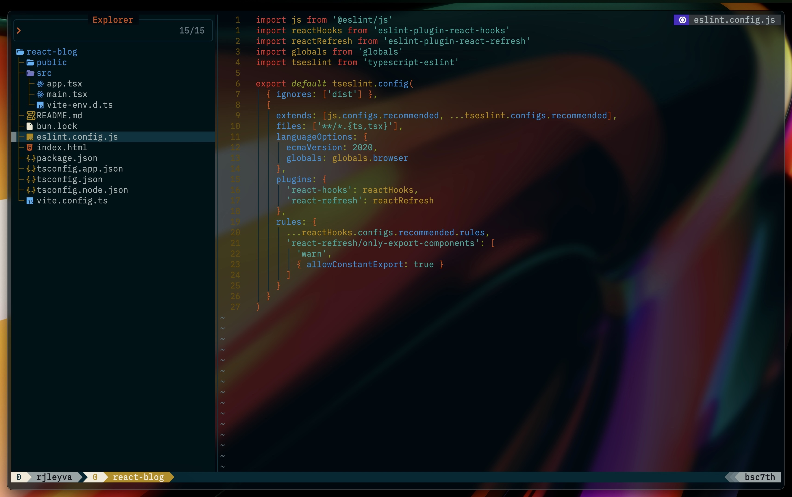

# bsc7th's dotfiles

Most of my plugins come from [Folke's](https://github.com/folke) Neovim config, with a few others from talented developers at Neovim Spectrum. My workflow is inspired by [Josean Martinez's](https://github.com/josean-dev) and [Takuya Matsuyama](https://github.com/craftzdog), also known as [craftzdog](https://github.com/craftzdog) or [devaslife](https://www.youtube.com/results?search_query=devaslife) on YouTube. You can also check [Neovim website](https://neovim.io/) as a guide, as it provides detailed information on each plugins helping you better understand how things work.

If you need detailed, beginner-friendly guidelines on how to set up Neovim from scratch, I highly recommend the following:

- [How I Setup Neovim To Make It AMAZING in 2024: The Ultimate Guide](https://www.youtube.com/watch?v=6pAG3BHurdM) by [Josean Martinez](https://github.com/josean-dev)

- [0 to LSP : Neovim RC From Scratch](https://www.youtube.com/watch?v=w7i4amO_zaE) by [ThePrimeagen](https://github.com/ThePrimeagen)

- [The Only Video You Need to Get Started with Neovim](https://www.youtube.com/watch?v=m8C0Cq9Uv9o) by [TJ DeVries](https://github.com/tjdevries)

If you're using [LazyVim distro](https://www.lazyvim.org/) you can check the following:

- [LazyVim Documentation](https://www.lazyvim.org/) 💤

- [LazyVim From Scratch To BEAST MODE](https://www.youtube.com/watch?v=evCmP4hH7ZU) by [Omer Hamerman](https://www.youtube.com/@devopstoolbox) also known as [DevOps Toolbox](https://www.youtube.com/@devopstoolbox) on YouTube, and [omerxx](https://github.com/omerxx) on GitHub.

- [Effective Neovim setup for web development towards 2024](https://www.youtube.com/watch?v=fFHlfbKVi30) by [Takuya Matsuyama](https://github.com/craftzdog) also koown as [devaslife](https://www.youtube.com/@devaslife) on YouTube, and [craftzdog](https://github.com/craftzdog) on GitHub.

- [Effective NeoVim Setup for Full-Stack Web Development in 2024](https://www.youtube.com/watch?v=V070Zmvx9AM) by [Mateo Sindičić](https://www.youtube.com/@sindo_dev) also known as [Sindo](https://www.youtube.com/@sindo_dev) on YouTube, and [JazzyGrim](https://github.com/JazzyGrim?tab=repositories) on GitHub.

## 🔗 My Current Plugins


## 👻 [Ghostty Configuration](https://github.com/bsc7th/dotfiles/tree/main/ghostty)

I’ve been hooked on [WezTerm](https://wezterm.org/) ever since I dove into web development 6 months ago. But today, March 21, 2025, I’m switching things up and giving the awesome [Ghostty](https://ghostty.org/) terminal a try!



### config

```
# Control the auto-update functionality of Ghostty
auto-update = check

# The release channel to use for auto-updates
auto-update-channel = stable

# Adjusts the width of each cell in the terminal as a percentage of the terminal's width.
adjust-cell-width = 3%

# Adjusts the height of each cell in the terminal as a percentage of the terminal's height.
adjust-cell-height = 3%

# Adjusts the vertical alignment of text by modifying the font's baseline.
adjust-font-baseline = 20%

# Sets the terminal's background color using a hexadecimal color code.
background = #031219

# Applies a blur effect to the background with the specified radius, creating a frosted glass look.
background-blur-radius = 20

# Sets the opacity level of the background, where 1 is fully opaque and 0 is fully transparent.
background-opacity = 0.75

# Enables the use of default configuration files provided by Ghostty.
config-default-files = true

# Defines the cursor's appearance; options include 'block', 'underline', or 'bar'.
cursor-style = block

# Determines whether the cursor blinks; set to 'true' to enable blinking, 'false' to disable.
cursor-style-blink = false

# Sets the cursor's color using a hexadecimal color code.
cursor-text = #AE8B2D

# Specifies the font family to be used in the terminal; ensure the font is installed on your system.
font-family = "PlemolJP Console NF"

# Enables bold styling for the terminal's font.
font-family-bold = true

# Enables font thickening, making the text appear bolder.
font-thicken = true

# Applies specific font features; the exact effect depends on the font being used.
font-feature = 1

# Sets the font size in points; adjust as needed for readability.
font-size = 19

# Determines whether the terminal follows the mouse focus; set to 'true' to enable, 'false' to disable.
focus-follows-mouse = false

# Binds a key combination to a specific action; in this case, 'cmd+o' toggles the quick terminal.
keybind = global:cmd+o=toggle_quick_terminal

# macOS-specific settings:

# Hides the title bar on macOS; options include 'hidden', 'always', or 'never'.
macos-titlebar-style = hidden

# Hides the application icon in the title bar on macOS.
macos-titlebar-proxy-icon = hidden

# Determines whether non-native fullscreen is used on macOS; set to 'true' to enable, 'false' to disable.
macos-non-native-fullscreen = false

# Hides the mouse cursor while typing; set to 'true' to enable, 'false' to disable.
mouse-hide-while-typing = true

# Sets the position of the quick terminal; options include 'top', 'bottom', 'left', or 'right'.
quick-terminal-position = bottom

# Specifies the shell integration; options include 'bash', 'zsh', etc.
shell-integration = zsh

# Applies a color theme to the terminal; ensure the theme is installed or available.
theme = "Solarized Dark - Patched"

# Enables window decorations, such as borders and title bars, around the terminal window.
window-decoration = true

# Sets the horizontal padding (left and right) inside the terminal window.
window-padding-x = 5

# Sets the vertical padding (top and bottom) inside the terminal window.
window-padding-y = 7

# Ensures consistent padding around the window's content.
window-padding-balance = true
```

## 🈁 [TMUX Configuration](https://github.com/tmux/tmux/wiki)

I use [Takuya Matsuyama](https://github.com/craftzdog) tmux custom theme and [Josean Martinez's](https://github.com/josean-dev?tab=repositories) keybindings.


[tmux.conf](https://github.com/bsc7th/dotfiles/blob/main/tmux/.tmux.conf)

[craftzdog macos.conf](https://github.com/craftzdog/dotfiles-public/blob/master/.config/tmux/macos.conf)

[craftzdog statusline.conf](https://github.com/craftzdog/dotfiles-public/blob/master/.config/tmux/statusline.conf)

[cratfzdog theme.conf](https://github.com/craftzdog/dotfiles-public/blob/master/.config/tmux/theme.conf)

[craftzdog utility.conf](https://github.com/craftzdog/dotfiles-public/blob/master/.config/tmux/utility.conf)

## 📚 [Yazi Configuration](https://yazi-rs.github.io/docs/installation/)


[keymap.toml](https://github.com/bsc7th/dotfiles/blob/main/yazi/keymap.toml)

[yazi.toml](https://github.com/bsc7th/dotfiles/blob/main/yazi/yazi.toml)

## 💪 VSCode Configuration

Flexibility is essential.


